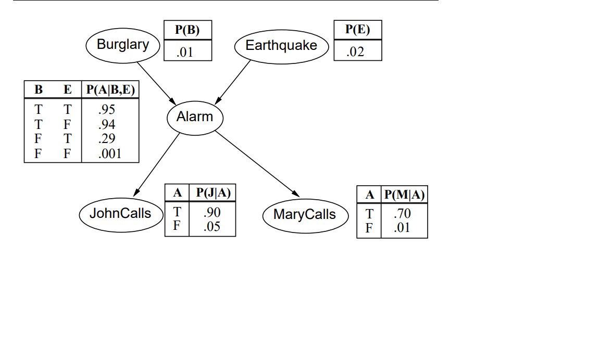

#Twierdzenie Bayesa


$P(Y|X) = \frac{P(Y) * P(X|Y)}{P(X)}$  

W przypadku, gdy $Y$ oznacza przynależność obserwacji do jednej z $K$ klas: 


$P(Y_{k}|X) = \frac{P(Y_{k}) * P(X|Y_k)}{\sum_{k=1}^K{P(Y_k)*P(X|Y_{k})}}$  

$P(Y_{k})$ prawdopodobieństwa apriori, wyznaczane na podstawie częstości występowania klas w próbie

$P(X|Y_k))$ prawdopodobieństwo zaobserwowania X  przy założeniu  przynależności do klasy $k$ -tej. 


Reguła Bayesa:  
Zaobserwowany wektor x klasyfikujemy jako pochodzący z tej klasy k, dla której wartość  
$p_k(X) = P(Y_{k}|X)$ jest największa


#Naiwny klasyfikator Bayesa


## Predyktory dyskretne Multinomial naive Bayes 

### Jeden predyktor 

Jakie jest p-stwo przeżycia pasażera, jeżeli wiemy że ma bilet w określonej klasie (Pclass)?  
X - Pclass
Y - Survived


Dla pasażerów pierwszej klasy p-stwo przeżycia wynosi:  

$P(Survived=1|Pclass=1)=\frac{P(Survived=1) * P(Class=1|Survived=1)}{P(Pclass=1)}$

```{r}


library(titanic)
library(ggplot2)


train<-titanic_train
train$Survived<-as.factor(train$Survived)
train$Pclass<-as.factor(train$Pclass)
train$Sex<-as.factor(train$Sex)

ggplot(data=train, aes(Pclass, fill=Survived)) + geom_bar(stat="count", position="stack")
table(train[c("Survived", "Pclass")])

#p-stwo przeżycia (apriori)
P_Survived_1<-nrow(train[train$Survived==1,]) / nrow(train)
P_Survived_1


P_Survived_0<-nrow(train[train$Survived==0,]) / nrow(train)
P_Survived_0

#p-stwo bycia pasażerem pierwszej klasy 
P_Class_1 <- nrow(train[train$Pclass==1,]) / nrow(train)

#p-stwo trafienia na pasażera pierszej klasy w grupie ocalonych
P_Class_1_Survived_1 <- nrow(train[train$Pclass==1 & train$Survived ==1,]) / nrow(train[train$Survived==1,])
P_Class_1_Survived_0 <- nrow(train[train$Pclass==1 & train$Survived ==0,]) / nrow(train[train$Survived==1,])

P_Survived_1_Pclass_1 <- (P_Survived_1 * P_Class_1_Survived_1) / (P_Class_1_Survived_1*P_Survived_1 + P_Class_1_Survived_0*P_Survived_0)
P_Survived_1_Pclass_1
```

Prawdopodobieństwo przeżycia dla pasażera pierwszej klasy wynosi więc:  `r P_Survived_1_Pclass_1`

```{r}

P_Pclass<-table(train$Pclass)/sum(table(train$Pclass))

P_Class_Survived_1<-(table(train$Pclass, train$Survived)[,2])/ sum(table(train$Pclass, train$Survived)[,2])

#we wszystkich klasach: 
P_Survived_1_Pclass <- P_Survived_1 * P_Class_Survived_1 / P_Pclass

P_Survived_1_Pclass
```
Wektor prawdopodobieństw przeżycia dla klasy wynosi więc:  `r P_Survived_1_Pclass`  
Dla porówania : 

```{r}


P_Class_Survived_1<-(table(train$Pclass, train$Survived)[,2])/ (table(train$Pclass, train$Survived)[,1] + table(train$Pclass, train$Survived)[,2])

P_Survived_1_Pclass
```


```{r}

library(e1071)
model<-naiveBayes(Survived~Pclass, data=train)

pred<-suppressWarnings(predict(model, train, type="raw"))
model$apriori
model$tables
head(cbind(train$Pclass, pred),10)


```


### Więcej niż jedna  zmienna objaśniająca

```{r}

ggplot(data=train, aes(Pclass, fill=Survived)) + geom_bar(stat="count", position="stack")
ggplot(data=train, aes(Sex, fill=Survived)) + geom_bar(stat="count", position="stack")

model2<-naiveBayes(Survived~Sex+Pclass, data=train)

model2$apriori
model2$tables


#Zalozmy, ze intersuje nas p-stwo ratunku  dla kobiety w pierwszej klasie 


P<-(model2$tables$Pclass[2,1]*model2$tables$Sex[2,"female"]*model2$apriori[2] ) /
(model2$tables$Pclass[2,1]*model2$tables$Sex[2,"female"]*model2$apriori[2] + model2$tables$Pclass[1,1]*model2$tables$Sex[1,"female"]*model2$apriori[1])
P


#Predykcja na pozostałych obserwacjach: 

pred2<-predict(model2, train, type="raw")
head(cbind(train[,c("Pclass","Sex","Survived")],pred2))


```


##Ciagłe predyktory 


Prawdopodobieństwo aposteriori przynależnośći do klasy: 

$p_k(X) = Pr(Y=k|X=x) = \frac{\pi_k f_k(x)}{\sum_{r=1}^{K}\pi_r f_r(x)}$  

$\pi_k$ - szacujemy na podstawie próby danych (częstość wystąpień obserwacji w próbie)


$f_k(X) = Pr(X=x|Y=k)$ gęstość rozkładu zmiennej X dla obserwacji należących do K-tej klasy. 


Równoważnie można wybrać tę klasę, dla której największa jest wartość: $\pi_k f_k(x)$  


```{r}


data("iris")

summary(iris)

ggplot(data=iris, aes(x=Sepal.Width, color=Species, fill=Species)) + geom_density(alpha=0.1) + scale_fill_discrete() 
ggplot(data=iris, aes(x=Sepal.Length, color=Species, fill=Species)) + geom_density(alpha=0.1) + scale_fill_discrete()
ggplot(data=iris, aes(x=Petal.Length, color=Species, fill=Species)) + geom_density(alpha=0.1) + scale_fill_discrete()
ggplot(data=iris, aes(x=Petal.Width, color=Species, fill=Species)) + geom_density(alpha=0.1) + scale_fill_discrete()

```


### Jedna zmienna objaśniająca 

Załóżmy, że 

$f_k(x)$  ma rozkład normalny z parametrami $\mu_k$ oraz $\sigma_k^2$


```{r, echo=TRUE}

model<-naiveBayes(Species~Sepal.Width, data=iris)
model$apriori
model$tables


#Wartość funkcji rozkładu gęstości pstwa dla rozkładu normalnego 
# Dla wartości Sepal.Width = 3.5 mamy odpowiednie wartości rozkładów 
P_Species<- dnorm(c(3.5,3.5,3.5), mean=model$tables$Sepal.Width[,1], sd=model$tables$Sepal.Width[,2])/
                sum(dnorm(c(3.5,3.5,3.5), mean=model$tables$Sepal.Width[,1], sd=model$tables$Sepal.Width[,2]))

P_Species

pred<-predict(model, iris, type="raw")
head( cbind (iris$Sepal.Width, pred ))

```

### Wiele zmiennych objaśniajacych 

```{r, echo=TRUE}
model<-naiveBayes(Species~., data=iris)
model$apriori
model$tables


pred_Species<-predict(model, iris)
head(cbind(iris, pred_Species ))

table(iris$Species, pred_Species)


pred<-predict(model, iris, type="raw")
head(cbind(iris, pred ))

```

#Sieci Bayesa 
## Definicja 
Sieć bayesowska to acykliczny (nie zawierający cykli) graf skierowany, w którym: 

• węzły reprezentują zmienne losowe (np. temperaturę jakiegoś źródła, stan pacjenta, cechę obiektu itp.)

• łuki (skierowane) reprezentują zależnośd typu „ zmienna X ma bezpośredni wpływ na zmienna Y”, 

• każdy węzeł X ma stowarzyszona z nim tablice prawdopodobieństw warunkowych określających wpływ wywierany na X przez jego poprzedników (rodziców) w grafie, 

• zmienne reprezentowane przez węzły przyjmują wartości dyskretne (np.: TAK, NIE).


## Przykład
### ASIA network from Lauritzen & Spiegelhalter (1988)


“Shortness-of-breath (dyspnoea) may be due to tuberculosis, lung cancer or bronchitis, or none of them, or more than one of them. 

A recent visit to Asia increases the chances of tuberculosis, while smoking is known to be a risk factor for both lung cancer and bronchitis. 

The results of a single chest X-ray do not discriminate between lung cancer and tuberculosis, as neither does the presence or absence of dyspnoea.”

• T (tuberculosis), a two-level factor with levels yes and no.

• L (lung cancer), a two-level factor with levels yes and no.

• B (bronchitis), a two-level factor with levels yes and no.

• A (visit to Asia), a two-level factor with levels yes and no.

• S (smoking), a two-level factor with levels yes and no.

• X (chest X-ray), a two-level factor with levels yes and no.

• E (tuberculosis versus lung cancer/bronchitis), a two-level factor with levels yes and no.

```{r, echo=TRUE, message=FALSE, warning=FALSE}

library(bnlearn)
library(DiagrammeR)
library(Rgraphviz)
# create and plot the network structure.
asia.dag = model2network("[A][S][T|A][L|S][B|S][D|B:E][E|T:L][X|E]")
p<-graphviz.plot(asia.dag)

```


### Conditional probability tables (CPT)
Tablica prawdopodobieństw warunkowych 

```{r, echo=TRUE}
lv = c("yes", "no")

A.prob = array(c(0.01, 0.99), dim = 2, dimnames = list(A = lv))
S.prob = array(c(0.01, 0.99), dim = 2, dimnames = list(A = lv))

T.prob = array(c(0.05, 0.95, 0.01, 0.99), dim = c(2, 2),dimnames = list(T = lv, A = lv))

L.prob = array(c(0.1, 0.9, 0.01, 0.99), dim = c(2, 2),dimnames = list(L = lv, S = lv))
B.prob = array(c(0.6, 0.4, 0.3, 0.7), dim = c(2, 2),dimnames = list(B = lv, S = lv))
D.prob = array(c(0.9, 0.1, 0.7, 0.3, 0.8, 0.2, 0.1, 0.9), dim = c(2, 2, 2), dimnames = list(D = lv, B = lv, E = lv))

E.prob = array(c(1, 0, 1, 0, 1, 0, 0, 1), dim = c(2, 2, 2),dimnames = list(E = lv, T = lv, L = lv))
X.prob = array(c(0.98, 0.02, 0.05, 0.95), dim = c(2, 2),dimnames = list(X = lv, E = lv))

cpt = list(A = A.prob, S = S.prob, T = T.prob, L = L.prob, B = B.prob,D = D.prob, E = E.prob, X = X.prob)
bn = custom.fit(asia.dag, cpt)

bn$D


```
### Conditional probability queries (CPQs)
Wnioskowanie o zdarzeniach w sieciach Bayesa. 

Jakie jest p-stwo zajścia zdarzenia B = yes  pod warunkiem zobserwowania  A= no 

```{r, echo=TRUE}
cpquery(bn, event=(B == "yes"), evidence=(A == "no"))

```

### Przykład  2  
Dane można pobrać z: 
http://www.bnlearn.com/bnrepository/ 

Przykład do uruchomienia po przekopiowaniu pliku earthquake.rda do folderu roboczego. 




Alarm może zostać uruchomiony w wyniku  trzęsienia ziemii lub włamania.  Moi sąsiedzi, John lub Mary zazwyczaj powiadamiają  mnie, gdy  mają podejrzenie, że coś nie tak jest z moim domem. 


Prawdopodobieństwa przypisane do wierzchołków:


```{r, echo=TRUE}

load(file="earthquake.rda")

bn$Burglary$prob
bn$Earthquake$prob 
bn$Alarm$prob 
bn$JohnCalls$prob 
bn$MaryCalls$prob 
```

Przykłady zapytań: 

```{r, echo=TRUE}

#P-stwo  włamaia (odpowiada wartości z tabeli)
cpquery(bn, Burglary=="True", TRUE, n=9000000)

cpquery(bn, Earthquake=="True", TRUE, n=9000000)


#ustawienie liczby próbek dla Logical Sampling
#P-stwo, że otrzymam telefon od Johna (pod warunkiem że zostanie wyzwolony alarm): 
cpquery(bn, JohnCalls=="False", Alarm=="True", n=900000)


#P-stwo, że otrzymam telefon od Johna (bez względu na okoliczności)
cpquery(bn, JohnCalls=="True", TRUE)

#P-stwo, że nie otrzymam telefon od Johna (bez względu na okoliczności) 
cpquery(bn, JohnCalls=="False", TRUE)


```


```{r, echo=TRUE}


cpquery(bn, Alarm=="True", MaryCalls=="True", n=900000)

x<-cpquery(bn, Alarm=="True", TRUE, n=9000000)
p1<-0.7*x / (0.7*x + 0.01*(1-x))


cpquery(bn, JohnCalls=="True", MaryCalls=="True", n=900000)
p1*0.9 + (1-p1)*0.05

#Prawdopodobienstwo wyzwolenia alarmu 

bn$Alarm$prob["True",,]

t(bn$Burglary$prob)


bn$Alarm$prob["True",,]%*%(bn$Earthquake$prob)


cpquery(bn, Alarm=="True", (Burglary=="True"  & Earthquake=="True"), n=9000000)* cpquery(bn, Burglary=="True", TRUE, n=9000000)*cpquery(bn, Earthquake=="True", TRUE, n=9000000)
0.95*0.01*0.02

cpquery(bn, Alarm=="True", (Burglary=="False"  & Earthquake=="False"), n=9000000)* cpquery(bn, Burglary=="False", TRUE, n=9000000)*cpquery(bn, Earthquake=="False", TRUE, n=9000000)

0.01*0.99*0.98

cpquery(bn, Alarm=="True", (Burglary=="True"  & Earthquake=="False"), n=9000000)* cpquery(bn, Burglary=="True", TRUE, n=9000000)*cpquery(bn, Earthquake=="False", TRUE, n=9000000)
0.94*0.01*0.98


cpquery(bn, Alarm=="True", (Burglary=="False"  & Earthquake=="True"), n=9000000)* cpquery(bn, Burglary=="False", TRUE, n=9000000)*cpquery(bn, Earthquake=="True", TRUE, n=9000000)

0.29*0.99*0.02


cpquery(bn, Alarm=="True", (Burglary=="False"), n=9000000)
0.29*0.02 + 0.01*0.98


cpquery(bn, Alarm=="True", (Earthquake=="False"), n=9000000)
0.94*0.01 + 0.001*0.99

cpquery(bn, Alarm=="True", TRUE, n=9000000)
0.95*0.01*0.02 + 0.94*0.01*0.98 + 0.29*0.99*0.02+0.001*0.99*0.98

```
###Uczenie sieci Bayesa z danych 